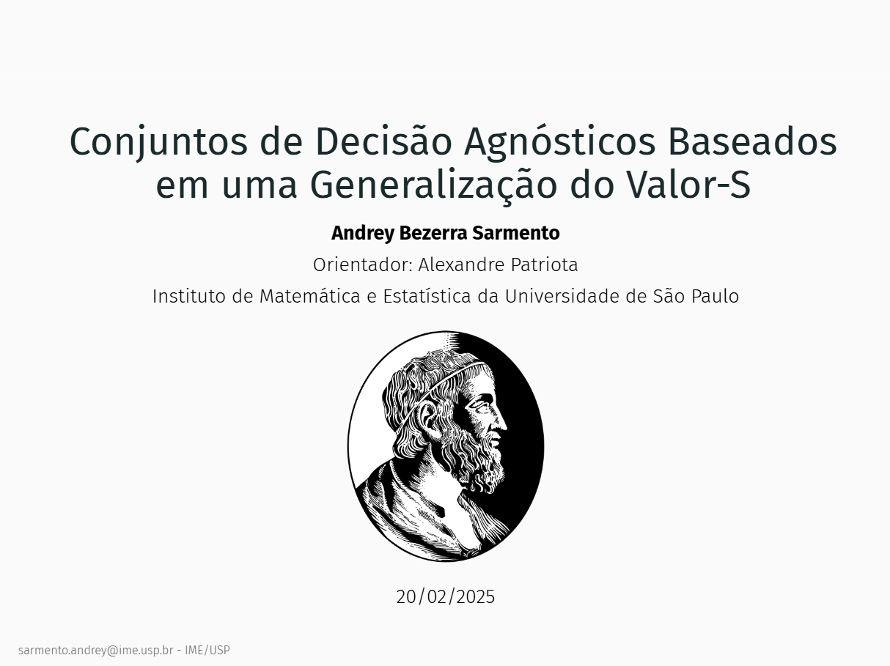

# Apresentação da Defesa de Mestrado (IME-USP)

## Conjuntos de Decisão Agnósticos e Valor-S

Esta apresentação foi preparada para a defesa de dissertação no Instituto de Matemática e Estatística da Universidade de São Paulo (IME-USP). Desenvolvida em R Markdown utilizando o pacote xaringan, ela reúne os principais resultados e contribuições do trabalho.

Acesse a apresentação clicando na imagem.

