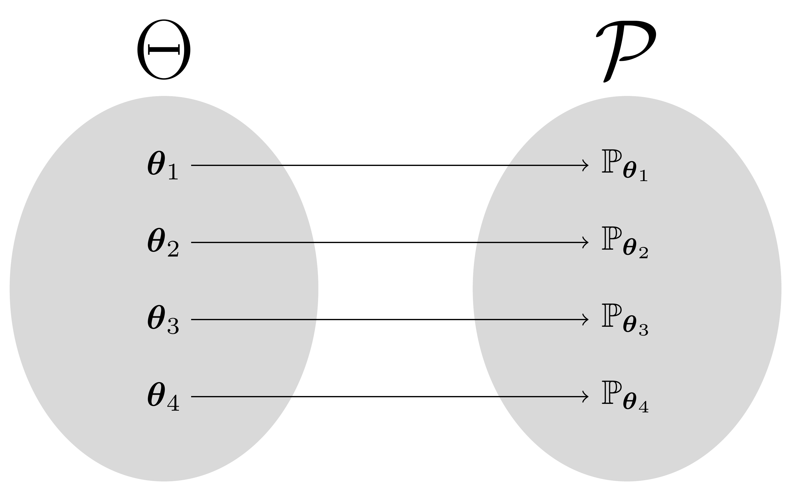
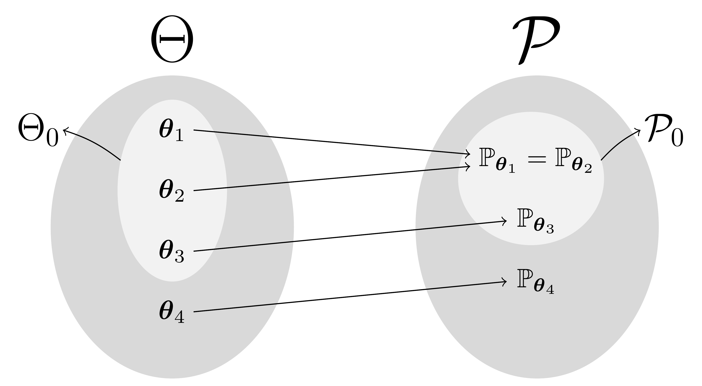

---
params:
  title: 'Conjuntos de Decisão Agnósticos Baseados em uma Generalização do Valor-S'
  author: 'Andrey Bezerra Sarmento'
  orientador: 'Alexandre Patriota'
  institute: 'Instituto de Matemática e Estatística da Universidade de São Paulo'
  date: '20/02/2025'
output:
  xaringan::moon_reader:
    css: [default, metropolis, metropolis-fonts, my-styles.css]
    lib_dir: libs
    nature:
      highlightStyle: github
      highlightLines: true
      countIncrementalSlides: false
---

```{r setup, include = F}
setwd(dirname(rstudioapi::getActiveDocumentContext()$path))
options(htmltools.dir.version = F)
library(kableExtra)
```

```{r, load_refs, include = F, cache = F}
# Bibliografias e Referências
library(RefManageR)
BibOptions(check.entries = F,
           bib.style = 'authoryear',
           style = 'markdown',
           hyperlink = F,
           dashed = F,
           sorting = 'nyt')
myBib = ReadBib('Bib/bibliografia.bib', check = F)
```

<!--
class: title-slide, center, middle
-->

# `r params$title`

**`r params$author`**

<div class="orientador">Orientador: `r params$orientador`</div>
<div class="institute">`r params$institute`</div>

<div class="date">`r params$date`</div>

---

# Organização

## Introdução

- Modelo Estatístico Clássico
- Hipótese Estatística
- Procedimentos Neyman-Pearson $\times$ Fisher
- Testes de Hipóteses com Três Possibilidades de Decisão

---

# Modelo Estatístico Clássico

## Definição
Um modelo estatístico formal é definido pela trinca $(\mathcal{X},\mathcal{F},\mathcal{P})$, em que:  
- $\mathcal{X} \subseteq \mathbb{R}^n$: espaço amostral (conjunto de todos os possíveis resultados de um experimento aleatório);

- $\mathcal{F}$: $\sigma$-álgebra de subconjuntos de $\mathcal{X}$;

- $\mathcal{P} = \{\mathbb{P}_{\boldsymbol{\theta}} : \boldsymbol{\theta} \in \Theta\}$: família de medidas de probabilidade;

- $\boldsymbol{\theta} \in \Theta$: vetor de parâmetros, com $\Theta$ sendo o espaço paramétrico.

**Objetivo:** Reduzir a família $\mathcal{P}$ para uma subfamília *plausível* $\mathcal{P}_0\subset\mathcal{P}$.

---

# Modelo Estatístico Clássico

Ilustração simples em que $\mathcal{P}$ contém apenas 4 medidas de probabilidade, e a relação entre o espaço paramétrico $\Theta$ e a família $\mathcal{P}$ é biunívoca (**modelo identificável**).

```{r, echo = F, out.width = '70%', fig.align = 'center'}

```

---

# Modelo Estatístico Clássico

Ilustração simples em que $\mathcal{P}$ contém apenas 4 medidas de probabilidade, e a relação entre o espaço paramétrico $\Theta$ e a família $\mathcal{P}$ é biunívoca (**modelo identificável**).

```{r, echo = F, out.width = '79%', fig.align = 'center'}

```

---

# Modelo Estatístico Clássico

Ilustração simples em que $\mathcal{P}$ contém apenas 3 medidas de probabilidade, e a relação entre o espaço paramétrico $\Theta$ e a família $\mathcal{P}$ é não biunívoca (**modelo não identificável**). Considere $\boldsymbol{\theta}_1\neq\boldsymbol{\theta}_2$.

```{r, echo = F, out.width = '70%', fig.align = 'center'}

```

---

# Modelo Estatístico Clássico

Ilustração simples em que $\mathcal{P}$ contém apenas 3 medidas de probabilidade, e a relação entre o espaço paramétrico $\Theta$ e a família $\mathcal{P}$ é não biunívoca (**modelo não identificável**). Considere $\boldsymbol{\theta}_1\neq\boldsymbol{\theta}_2$.

```{r, echo = F, out.width = '79%', fig.align = 'center'}

```

---

# Hipótese Estatística

Uma hipótese estatística é uma interpretação matemática de uma hipótese científica.

- Hipótese científica: "a moeda é honesta"

Experimentos:

- **Binomial** $$\mathcal{H}_{0}^{\text{Bin}}:X\sim\text{Bin}(10,\theta=0.5) \quad \iff \quad \mathcal{H}_{0}^{\text{Bin}}: \theta = 0.5,$$ em que $X$ é o número de faces "cara" em 10 lançamentos independentes da moeda.

- **Binomial Negativo** $$\mathcal{H}_{0}^{\text{NBin}}:Y\sim\text{NBin}(10, \theta=0.5) \quad \iff \quad \mathcal{H}_{0}^{\text{NBin}}: \theta = 0.5,$$ em que $Y$ é o número de lançamentos da moeda até a ocorrência de 10 faces "cara".

---

# Hipótese Estatística

## Fisher

- Define apenas uma hipótese, $\mathcal{H}_0$.
- Avalia a evidência contra $\mathcal{H}_0$ com base nos dados observados (valor-p).
- Não necessariamente toma uma decisão entre rejeitar ou não rejeitar.
- Caso seja necessário tomar uma decisão, apenas rejeita ou não rejeita a hipótese.

## Neyman-Pearson

- Define duas hipóteses: $\mathcal{H}_0:\boldsymbol{\theta}\in\Theta_0 \text{ e } \mathcal{H}_1:\boldsymbol{\theta}_0\in\Theta_0^c$.
- Utilizam o termo "aceitar $\mathcal{H}_0$".
- Erro Tipo I (Rejeita $\mathcal{H}_0$ quando é verdadeira) e Erro tipo II (Aceita $\mathcal{H}_0$ quando é falsa).
- Poder do teste.

A aceitação/rejeição de uma hipótese pode ser considerada uma decisão provisória e sujeita a modificações futuras com base em novas evidências. Ao longo deste trabalho, a aceitação/rejeição será sempre interpretada de forma não definitiva.

---

# Hipótese Estatística

`r Citet(myBib, 'schneider2015null')` debate com mais detalhes as diferenças entre os testes de significância de Fisher e os testes de hipóteses de Neyman-Pearson.

```{r, echo = F, out.width = '79%', fig.align = 'center'}

```

---

# Testes de Hipóteses com 3 Decisões

`r Citet(myBib, 'neymanb')`.

```{r, echo = F, fig.align = 'center', out.width = '90%'}


```

---

# Testes de Hipóteses com 3 Decisões

`r Citet(myBib, 'berg2004no')`.

```{r, echo = F, fig.align = 'center', out.width = '70%'}

```

Este procedimento consiste em testar hipóteses simples (nula e alternativa), isto é, $$\mathcal{H}_0:\theta_0=\theta_0^{*} \quad \text{contra} \quad \mathcal{H}_1:\theta_0=\theta_1^{*}.$$

---

# Testes de Hipóteses com 3 Decisões

`r Citet(myBib, 'patriota2013classical')`.

```{r, echo = F, fig.align = 'center', out.width = '80%'}
knitr::include_graphics('Figuras/Others/Patriota.png')

```

---

# Testes de Hipóteses com 3 Decisões

`r Citet(myBib, 'esteves2016logical')`.

```{r, echo = F, fig.align = 'center', out.width = '100%'}

```

---

# Testes de Hipóteses com 3 Decisões

`r Citet(myBib, 'coscrato2020agnostic')`.

```{r, echo = F, fig.align = 'center', out.width = '90%'}
knitr::include_graphics('Figuras/Others/Coscrato.png')
```

---

# Tópicos

- Região de Confiança
- Família Regular de Regiões de Confiança
- Valor-S Generalizado
- Monotonicidade
- Conjuntos de Decisão
- Propriedades
- Estudo de Simulação
- Conclusão

---

# Família Regular de Regiões de Confiança

## Região de Confiança  

Seja $\alpha \in (0,1)$ fixado.

- Uma região de confiança de nível $1-\alpha$ para $\boldsymbol{\theta}$ é uma função $\Lambda_{\alpha}^{\cdot}:\mathcal{X}\to2^{\Theta}$.

- Então, para cada $\boldsymbol{x}_n \in \mathcal{X}$, tem-se $\Lambda_{\alpha}^{\boldsymbol{x}_n} \subseteq \Theta$.

- Uma região de confiança de nível $1-\alpha$, vista como um conjunto aleatório ($\Lambda_\alpha^{\boldsymbol{X}_n}$), deve ser tal que
\begin{equation}
  \mathbb{P}_{\boldsymbol{\theta}}(
  \Lambda_\alpha^{\boldsymbol{X}_n} \ni \boldsymbol{\theta}) \geq
  1 - \alpha,
  \quad \text{para cada } \ \boldsymbol{\theta} \in \Theta.
\end{equation}

- Com isso, uma região de confiança de nível $1-\alpha$ fornece um conjunto de valores *plausíveis* para $\boldsymbol{\theta}$.

---

# Família Regular de Regiões de Confiança

## Definição de FRRC

**Família Regular de Regiões de Confiança - FRRC**. Seja $\{\Lambda_\alpha^{\boldsymbol{x}_n}\}_{\alpha\in(0,1)}$ uma coleção de funções $\Lambda_\alpha^{\cdot}:\mathcal{X}\to2^{\Theta}$. Tal coleção é dita ser uma Família Regular de Regiões de Confiança (FRRC) para $\boldsymbol{\theta}$ se, e somente se, as seguintes condições de regularidade forem satisfeitas:
    
- $\mathbb{P}_{\boldsymbol{\theta}}\left(\Lambda_\alpha^{\boldsymbol{X}_n} \ni \boldsymbol{\theta}\right) \geq 1 - \alpha$, para cada $\boldsymbol{\theta} \in \Theta$ e cada $\alpha\in(0,1)$;
        
- $\bigcup\limits_{\alpha \in (0,1)} \Lambda_\alpha^{\boldsymbol{x}_n} = \Theta$, para cada $\boldsymbol{x}_n\in\mathcal{X}$;
        
- $\bigcap\limits_{\alpha \in (0,1)} \Lambda_\alpha^{\boldsymbol{x}_n} \neq \varnothing$, para cada $\boldsymbol{x}_n\in\mathcal{X}$.

Dizemos que $\alpha\in(0,1)$ é o nível de significância.

---

# Família Regular de Regiões de Confiança

## Definição de FRRC

**Família Regular de Regiões de Confiança - FRRC**. Seja $\{\Lambda_\alpha^{\boldsymbol{x}_n}\}_{\alpha\in(0,1)}$ uma coleção de funções $\Lambda_\alpha^{\cdot}:\mathcal{X}\to2^{\Theta}$. Tal coleção é dita ser uma Família Regular de Regiões de Confiança (FRRC) para $\boldsymbol{\theta}$ se, e somente se, as seguintes condições de regularidade forem satisfeitas:
    
- $\mathbb{P}_{\boldsymbol{\theta}}\left(\Lambda_\alpha^{\boldsymbol{X}_n} \ni \boldsymbol{\theta}\right) \geq 1 - \alpha$, para cada $\boldsymbol{\theta} \in \Theta$ e cada $\alpha\in(0,1)$;
        
- $\bigcup\limits_{\alpha \in (0,1)} \Lambda_\alpha^{\boldsymbol{x}_n} = \Theta$, para cada $\boldsymbol{x}_n\in\mathcal{X}$;

- $\bigcap\limits_{\alpha \in (0,1)} \Lambda_\alpha^{\boldsymbol{x}_n} \neq \varnothing$, para cada $\boldsymbol{x}_n\in\mathcal{X}$.
$$\color{blue}{
\bigcap\limits_{\alpha \in (0,1)} \Lambda_\alpha^{\boldsymbol{x}_n} \neq \varnothing \iff
\Lambda_{\alpha}^{\boldsymbol{x}_n}\neq\varnothing, \text{ para cada } \alpha\in(0,1).
}$$

---

# Família Regular de Regiões de Confiança

**Aninhamento.** Uma FRRC para $\boldsymbol{\theta}$, $\{\Lambda_{\alpha}^{\boldsymbol{x}_n}\}_{\alpha\in(0,1)}$, satisfaz a propriedade de aninhamento se, e somente se, para cada $\boldsymbol{x}_n\in\mathcal{X}$,

$$
\begin{aligned}
    \begin{cases}
        \Lambda_{\alpha_1}^{\boldsymbol{x}_n} \subset \Lambda_{\alpha_2}^{\boldsymbol{x}_n} \implies \alpha_1 > \alpha_2 \\
        \Lambda_{\alpha_1}^{\boldsymbol{x}_n} \subseteq \Lambda_{\alpha_2}^{\boldsymbol{x}_n} \impliedby \alpha_1 > \alpha_2
    \end{cases},
    \quad \text{para cada } \alpha_1, \alpha_2 \in (0, 1).
\end{aligned}
$$

<div style='text-align: center;'>
  
</div>

Exemplo considerando $\boldsymbol{\theta} = [\theta_1\ \theta_2]^{\top} \in \Theta \subseteq \mathbb{R}^2$.

---

# Família Regular de Regiões de Confiança

**Consistência.** Seja $B_{\boldsymbol{\theta},\varepsilon} = \left\{\boldsymbol{\theta}_0\in\Theta:||\boldsymbol{\theta}-\boldsymbol{\theta}_0||\leq\varepsilon\right\}$
uma bola em torno de $\boldsymbol{\theta}$, para cada $\boldsymbol{\theta}\in\Theta$ e $\varepsilon>0$. Diz-se que a FRRC $\left\{\Lambda_{\alpha}^{\boldsymbol{x}_n}\right\}_{\alpha\in(0,1)}$ é consistente se, para cada $\varepsilon>0$ e $\alpha\in(0, 1)$, satisfaz:

$$
\begin{equation}
    \lim_{n\rightarrow\infty}\mathbb{P}_{\boldsymbol{\theta}}\left(\overline{\Lambda_{\alpha}^{\boldsymbol{X}_n}}\subseteq B_{\boldsymbol{\theta},\varepsilon}\right) =
    1, \quad \text{para cada } \boldsymbol{\theta}\in\Theta,
\end{equation}
$$
em que $\overline{\Lambda_{\alpha}^{\boldsymbol{X}_n}}$ é o fecho de $\Lambda_{\alpha}^{\boldsymbol{X}_n}$.

---

# Família Regular de Regiões de Confiança

## Definição de FRRCA

**Família Regular de Regiões de Confiança Assintóticas - FRRCA**. Seja $\{\tilde\Lambda_\alpha^{\boldsymbol{x}_n}\}_{\alpha\in(0,1)}$ uma coleção de funções $\tilde\Lambda_\alpha^{\cdot}:\mathcal{X}\to2^{\Theta}$. Tal coleção é dita ser uma Família Regular de Regiões de Confiança Assintóticas (FRRCA) para $\boldsymbol{\theta}$ se, e somente se, satisfaz as seguintes condições de regularidade:
    
- $\lim\limits_{n\rightarrow\infty}\mathbb{P}_{\boldsymbol{\theta}}\left(\tilde{\Lambda}_\alpha^{\boldsymbol{X}_n}\ni\boldsymbol{\theta}\right) \geq 1 - \alpha$, para cada $\boldsymbol{\theta} \in \Theta$ e cada $\alpha\in(0,1)$;
        
- $\bigcup\limits_{\alpha \in (0,1)} \Lambda_\alpha^{\boldsymbol{x}_n} = \Theta$, para cada $\boldsymbol{x}_n\in\mathcal{X}$;

- $\bigcap\limits_{\alpha \in (0,1)} \Lambda_\alpha^{\boldsymbol{x}_n} \neq \varnothing$, para cada $\boldsymbol{x}_n\in\mathcal{X}$.

---

# Valor-S Generalizado

## Definição

**Valor-S Generalizado.** Seja $\{\Lambda_{\alpha}^{\boldsymbol{x}_n}\}_{\alpha\in(0,1)}$ uma FRRC. Para cada $\boldsymbol{x}_n\in\mathcal{X}$, o valor-s é a função $s_{\boldsymbol{x}_n}:2^{\Theta}\to[0,1]$ tal que $$s_{\boldsymbol{x}_n}(\Theta_0) = \sup\{\alpha\in(0,1): \Lambda_\alpha^{\boldsymbol{x}_n} \cap \Theta_0 \neq \varnothing\}, \quad \text{se } \Theta_0 \neq \varnothing.$$
Define-se $s_{\boldsymbol{x}_n}(\varnothing)=0$.

---

# Valor-S Generalizado

## Definição

**Valor-S Generalizado.** Seja $\{\Lambda_{\alpha}^{\boldsymbol{x}_n}\}_{\alpha\in(0,1)}$ uma FRRC. Para cada $\boldsymbol{x}_n\in\mathcal{X}$, o valor-s é a função $s_{\boldsymbol{x}_n}:2^{\Theta}\to[0,1]$ tal que $$s_{\boldsymbol{x}_n}(\Theta_0) = \sup\{\alpha\in(0,1): \Lambda_\alpha^{\boldsymbol{x}_n} \cap \Theta_0 \neq \varnothing\}, \quad \text{se } \Theta_0 \neq \varnothing.$$
Define-se $s_{\boldsymbol{x}_n}(\varnothing)=0$.

<div style='text-align: center;'>
  
</div>

---

# Valor-S Generalizado

## Interpretação

- O valor-s é o maior nível de significância tal que a região de confiança contém pelo menos um elemento em comum do conjunto $\Theta_0$.

- $0<s_{\boldsymbol{x}_n}(\Theta_0)<1$ indica há informação que contradiz parcialmente o conjunto $\Theta_0$ de modo que quanto mais próximo de 0, mais informações contrárias a $\Theta_0$ foram observadas.

---

# Valor-S Generalizado

## Exemplo

Seja $\mathbf{Y}=\mathbf{X}\boldsymbol{\theta}+\boldsymbol{\epsilon}$, em que $\mathbf{Y}$ é uma matriz $(n \times 1)$ de respostas, $\mathbf{X}$ é uma matriz $(n \times p)$ de covariáveis, $\boldsymbol{\theta}$ é um vetor coluna $(p\times1)$ de parâmetros e $\boldsymbol{\epsilon}\sim\text{N}_{n}(\boldsymbol{0}, \sigma^2\mathbf{I})$, sendo $\mathbf{I}$ uma matriz identidade $n \times n$ e $\sigma^2$ conhecido. Para cada $\boldsymbol{\theta}\in\Theta=\mathbb{R}^{p}$, tem-se que
$$
\begin{equation*}
    T_{\boldsymbol{\theta}} =
    \frac{(n-p)\left(\boldsymbol{\theta}-\hat{\boldsymbol{\theta}}\right)^{\top}\mathbf{X}^{\top}\mathbf{X}\left(\boldsymbol{\theta}-\hat{\boldsymbol{\theta}}\right)}
    {p\left(\mathbf{Y}-\mathbf{X}\hat{\boldsymbol{\theta}}\right)^{\top}\left(\mathbf{Y}-\mathbf{X}\hat{\boldsymbol{\theta}}\right)}
    \sim F_{p,n-p},
\end{equation*}
$$
em que $\hat{\boldsymbol{\theta}} = \left(\mathbf{X}^{\top}\mathbf{X}\right)^{-1}\mathbf{X}^{\top}\mathbf{Y}$ é o EMV de $\boldsymbol{\theta}$ e a matriz $\mathbf{X}^{\top}\mathbf{X}$ é positiva definida.

Para $\alpha\in(0,1)$, seja
$$
\begin{equation}
    \Lambda_{\alpha}^{\boldsymbol{d}_n} =
    \left\{\boldsymbol{\theta}\in\mathbb{R}^{p}:T_{\boldsymbol{\theta}} \leq F^{-1}(1-\alpha)\right\},
\end{equation}
$$
em que $\boldsymbol{d}_n=[\mathbf{X}\ \mathbf{Y}]$ são os dados observados e $F(\cdot)$ é a função distribuição de uma variável aleatória F-Snedecor com $p$ e $n-p$ graus de liberdade no numerador e denominador, respectivamente. Portanto, $\{\Lambda_{\alpha}^{\boldsymbol{d}_n}\}_{\alpha\in(0,1)}$ é uma FRRC.

---

# Valor-S Generalizado

## Exemplo

Então, o valor-s para testar $\mathcal{H}_0:\boldsymbol{\theta}\in\Theta_0$ é dado por
$$
\begin{align*}
    s_{\boldsymbol{d}_n}(\Theta_0) &=
    \sup\left\{\alpha\in(0,1):\Lambda_{\alpha}^{\boldsymbol{d}_n}\cap\Theta_0\neq\varnothing\right\} \\ &=
    \sup\left\{\alpha\in(0,1):\alpha \leq 1 - F\left(\inf_{\boldsymbol{\theta}\in\Theta_0}T_{\boldsymbol{\theta}}\right)\right\} \\ &=
    1 - F\left(\inf_{\boldsymbol{\theta}\in\Theta_0}T_{\boldsymbol{\theta}}\right).
\end{align*}
$$

---

# Valor-S Generalizado

## Propriedades

Seja $s_{{\boldsymbol{x}_n}}$ o valor-s baseado em uma FRRC $\{\Lambda_{\alpha}^{{\boldsymbol{x}_n}}\}_{\alpha\in(0,1)}$ para $\boldsymbol{\theta}$. Então, para $\Theta_i \subseteq \Theta$, $i=0,1,2$, tem-se as seguintes propriedades:

- Se $\Theta_{0} \cap \left(\bigcap\limits_{\alpha \in (0,1)} \Lambda_\alpha^{\boldsymbol{x}_n}\right) \neq \varnothing$, então $s_{\boldsymbol{x}_n}(\Theta_{0}) = 1$.

- $s_{\boldsymbol{x}_n}(\Theta)=1$ e $s_{\boldsymbol{x}_n}(\varnothing)=0$.

- Se $\Theta_{1}\subseteq\Theta_{2}$, então $s_{{\boldsymbol{x}_n}}(\Theta_{1})\leq s_{{\boldsymbol{x}_n}}(\Theta_{2})$.

- $s_{{\boldsymbol{x}_n}}(\Theta_{0}) = 1$ ou $s_{\boldsymbol{x}_n}(\Theta_{0}^{c}) = 1$.

- $s_{{\boldsymbol{x}_n}}(\Theta_{0}) = \sup\limits_{\boldsymbol{\theta}\in\Theta_{0}} s_{{\boldsymbol{x}_n}}(\{\boldsymbol{\theta}\})$, para $\Theta_0\neq\varnothing$.

- $s_{{\boldsymbol{x}_n}}(\Theta_{1}\cup\Theta_{2}) = \max\Big\{s_{{\boldsymbol{x}_n}}(\Theta_{1}), s_{{\boldsymbol{x}_n}}(\Theta_{2})\Big\}$.

- $s_{{\boldsymbol{x}_n}}(\Theta_{1}\cap\Theta_{2}) \leq \min\big\{s_{{\boldsymbol{x}_n}}(\Theta_{1}), s_{{\boldsymbol{x}_n}}(\Theta_{2})\big\}$.

---

# Valor-S Generalizado

## Propriedades

- Seja $\alpha\in(0,1)$. Se $s_{{\boldsymbol{x}_n}}(\Theta_0)<\alpha$, então $\Lambda_{\alpha_o}^{{\boldsymbol{x}_n}}\subseteq\Theta_0^c$, para cada $\alpha_o\in[\alpha,1)$.

- $\mathbb{P}_{\boldsymbol{\theta}}\left(s_{\boldsymbol{X}_n}(\Theta_0)<\alpha\right)\leq\alpha$, para cada $\boldsymbol{\theta}\in\Theta_0$ e cada $\alpha\in(0,1)$.

- Se as regiões $\{\Lambda_{\alpha}^{{\boldsymbol{x}_n}}\}_{\alpha\in(0,1)}$ são aninhadas e consistentes, então, para $\Theta_0\subset\Theta\subseteq\mathbb{R}^{p}$ e qualquer $\alpha\in(0, 1)$,
$$
\begin{equation*}
    \lim_{n\to\infty}\mathbb{P}_{\boldsymbol{\theta}}\left(s_{\boldsymbol{X}_n}\left(\Theta_0\right) < \alpha\right) = 1,
    \quad \text{para cada } \boldsymbol{\theta} \in \text{int}(\Theta_0^c), 
\end{equation*}
$$
em que $\mbox{int}(A)$ é o interior do conjunto $A$.

---

# Monotonicidade

- As hipóteses $\mathcal{H}_{1}:\boldsymbol{\theta}\in\Theta_{1}$ e $\mathcal{H}_{2}:\boldsymbol{\theta}\in\Theta_{2}$ são aninhadas se, e somente se, $\Theta_{1}\subseteq\Theta_{2}$. 

- Neste caso, a afirmação de $\mathcal{H}_1$ implica a afirmação de $\mathcal{H}_2$ e, portanto, espera-se encontrar mais evidências contra $\mathcal{H}_{1}$ do que contra $\mathcal{H}_{2}$. 

```{r, echo = F, fig.align = 'center', out.width = '70%'}

```

---

# Monotonicidade

Para manter conclusões lógicas, medidas de evidência devem satisfazer a propriedade de monotonicidade, definida a seguir.

**Monotonicidade.** Seja $Q_{\boldsymbol{x}_n}$ uma função de subconjuntos do espaço paramétrico $\Theta$. Afirma-se que $Q_{\boldsymbol{x}_n}$ é monotônica se, e somente se, para todo $\Theta_{1} \subseteq \Theta_{2} \subseteq \Theta$, que estejam no domínio de $Q_{\boldsymbol{x}_n}$, $Q_{\boldsymbol{x}_n}(\Theta_{1}) \leq Q_{\boldsymbol{x}_n}(\Theta_{2})$.

- Qualquer medida de probabilidade a posteriori na abordagem Bayesiana satisfaz essa propriedade.

- valor-e `r Citep(myBib, 'pereira1999evidence')`. 

- valor-s `r Citep(myBib, 'patriota2013classical')`.

- o valor-p **não** satisfaz a propriedade de monotonicidade `r Citep(myBib, c('schervish1996p', 'patriota2013classical', 'izbicki2015logical', 'patriota2017some'))`.

---

# Monotonicidade

## Valor-p

- O valor-p é utilizado como uma medida de evidência para testar hipóteses estatísticas.

- Tem sido objeto de análise por não satisfazer a propriedade de monotonicidade.

## Definição

- Estatística $T_{\mathcal{H}_0}(\boldsymbol{X}_n)$ tal que quanto maior o seu valor observado, $T_{\mathcal{H}_0}(\boldsymbol{x}_n)$, maior é a discordância entre a hipótese testada $\mathcal{H}_0$ e os dados observados $\boldsymbol{x}_n$ `r Citep(myBib, 'Cox')`.

- Sob a hipótese $\mathcal{H}_0$, o valor-p é a probabilidade de se observar em outros experimentos um valor observado da estatística $T_{\mathcal{H}_0}(\boldsymbol{X}_n)$ tão extremo quanto o valor observado no experimento executado, isto é,
$$
\begin{equation}
    p_{\boldsymbol{x}_n}(\Theta_0) =
    \sup_{\boldsymbol{\theta}\in\Theta_0}\mathbb{P}_{\boldsymbol{\theta}}\big(T_{\mathcal{H}_0}(\boldsymbol{X}_n) \geq T_{\mathcal{H}_0}(\boldsymbol{x}_n)\big).
\end{equation}
$$

- Quanto menor o valor de $p_{\boldsymbol{x}_n}(\Theta_0)$, maior é a evidência contra $\mathcal{H}_0$.

---

# Monotonicidade

## Exemplo de Violação

Considere o modelo de regressão com $p=3$, ou seja, $\mathbf{Y}=\mathbf{X}\boldsymbol{\theta}+\boldsymbol{\epsilon}$, $\boldsymbol{\theta}=[\theta_0\ \theta_1\ \theta_2]^{\top}\in\Theta=\mathbb{R}^{3}$ e $\boldsymbol{\epsilon}\sim\text{N}_{n}(\boldsymbol{0}, \sigma^2\mathbf{I})$, em que $\mathbf{I}$ é uma matriz identidade $(n \times n)$ e $\sigma^2$ é conhecido.

Suponha que seja de interesse testar as hipóteses $$\mathcal{H}_{1}:\theta_1=\theta_2=0 \quad \mbox{e} \quad \mathcal{H}_{2}:\theta_1=0.$$

Note que o espaço paramétrico de cada hipótese é dado por

- $\Theta_{1}=\{\boldsymbol{\theta}\in\mathbb{R}^{3}:\theta_1=\theta_2=0\}$.

- $\Theta_2=\{\boldsymbol{\theta}\in\mathbb{R}^{3}:\theta_1=0\}$.

Como $\Theta_1 \subset \Theta_2$, espera-se encontrar mais evidências contra $\Theta_1$ do que contra $\Theta_2$, ou seja, $$p_{\boldsymbol{d}_n}(\Theta_1) < p_{\boldsymbol{d}_n}(\Theta_2).$$

---

# Monotonicidade

## Exemplo de Violação

Para testar $\mathcal{H}_1$ e $\mathcal{H}_2$, duas estatísticas podem ser definidas como
$$
\begin{equation*}
        T_{\hat{\boldsymbol{\theta}}_{j}}^{(j)} =
        \frac{(n-p)\left(\hat{\boldsymbol{\theta}}_{j}-\hat{\boldsymbol{\theta}}\right)^{\top}\mathbf{X}^{\top}\mathbf{X}\left(\hat{\boldsymbol{\theta}}_{j}-\hat{\boldsymbol{\theta}}\right)}
        {(p-p_j)\left(\mathbf{Y}-\mathbf{X}\hat{\boldsymbol{\theta}}\right)^{\top}\left(\mathbf{Y}-\mathbf{X}\hat{\boldsymbol{\theta}}\right)},
\end{equation*}
$$
para $j=1,2$, em que $\hat{\boldsymbol{\theta}}_j$ é o EMV restrito a $\Theta_{j}$, $p_1=1$ e $p_2=2$. Sob $\mathcal{H}_j$, tem-se que $T_{\hat{\boldsymbol{\theta}}_{j}}^{(j)} \sim F_{p-p_j,n-p}$, para $j=1,2$. Portanto, os valores-p de $\Theta_1$ e $\Theta_2$ são
$$
\begin{equation*}
  p_{\boldsymbol{d}_n}(\Theta_{j}) =
  \mathbb{P}\left(F_{p-p_j,n-p} \geq t_{\hat{\boldsymbol{\theta}}_{j}}^{(j)}\right), \quad \text{para } j = 1, 2,
\end{equation*}
$$
em que $t_{\hat{\boldsymbol{\theta}}_{j}}^{(j)}$ é o valor observado da estatística $T_{\hat{\boldsymbol{\theta}}_{j}}^{(j)}$. 

---

# Monotonicidade

## Exemplo de Violação

- $t_{\hat{\boldsymbol{\theta}}_{1}}^{(1)} = 3.149735$ e $t_{\hat{\boldsymbol{\theta}}_{2}}^{(2)} = 5.78221$.
- $p_{\boldsymbol{d}_{10}}(\Theta_1) = 0.1058$ e $p_{\boldsymbol{d}_{10}}(\Theta_2) = 0.0471$.
- Os dados observados apresentam mais evidências contra $\theta_1 = 0$ do que contra $\theta_1 = \theta_2 = 0$ $(0.0471<0.1058)$, o que viola a propriedade de monotonicidade.
- Considerando um ponto de corte de $5\%$, rejeita-se que $\theta_1 = 0$, mas não se rejeita que $\theta_1 = \theta_2 = 0$.

```{r, echo = F}
df = data.frame(y  = c(0.33, -0.24, 3.11, 0.69, 4.05, 1.71, 4.41, -2.05, 0.05, 0.78),
                x1 = c(-6.54, 1.30, 1.93, -1.68, 2.90, 3.54, 4.79, -4.71, 2.58, -4.10),
                x2 = c(0.27, -0.54, 1.00, 0.87, -0.56, 0.13, -0.26, -0.76, 0.05, -0.19))
colnames(df) = paste0('\\(', c('\\boldsymbol{y}', '\\boldsymbol{x}_1', '\\boldsymbol{x}_2'), '\\)')
kbl(t(df),
    format = 'html',
    booktabs = T,
    escape = F) %>%
    kable_styling(latex_options = 'HOLD_position')
```

---

# Monotonicidade

## Exemplo de Violação

```{r, echo = T, results = 'hide'}
df = data.frame(y  = c(0.33, -0.24, 3.11, 0.69, 4.05, 1.71, 4.41, -2.05, 0.05, 0.78),
                x1 = c(-6.54, 1.30, 1.93, -1.68, 2.90, 3.54, 4.79, -4.71, 2.58, -4.10),
                x2 = c(0.27, -0.54, 1.00, 0.87, -0.56, 0.13, -0.26, -0.76, 0.05, -0.19))
fit = lm(y ~ x1 + x2, data = df)
summary(fit)
```

---

# Monotonicidade

## Exemplo de Violação

```{r, echo = F}
summary(fit)
```

---

# Monotonicidade

Representação gráfica da monotonicidade do valor-s generalizado, considerando que as regiões em $\left\{\Lambda_{\alpha}^{\boldsymbol{x}_n}\right\}_{\alpha \in (0,1)}$ são aninhadas.

<div style='text-align: center;'>
  
</div>

---

# Conjuntos de Decisão

## Definição

**Conjuntos de Decisão**. Para qualquer $\boldsymbol{x}_n\in\mathcal{X}$ fixo, seja $s_{\boldsymbol{x}_n}$ o valor-s baseado em uma FRRC para $\boldsymbol{\theta}\in\Theta$. Para $\alpha_1,\alpha_2\in(0,1)$ fixos, os conjuntos Rejeição, Aceitação e Incerto são definidos, respectivamente, da seguinte forma:
$$
\begin{equation*}
\mathcal{R}_{\alpha_1}^{\boldsymbol{x}_n} =\{\Theta_{0}\subseteq\Theta:s_{\boldsymbol{x}_n}(\Theta_{0})<\alpha_1\},\quad  \quad \mathcal{A}_{\alpha_2}^{\boldsymbol{x}_n} = \{\Theta_{0}\subseteq\Theta:s_{\boldsymbol{x}_n}(\Theta_{0}^{c})<\alpha_2\}
\end{equation*}
$$
e
$$
\begin{equation*}
\mathcal{U}^{\boldsymbol{x}_n}_{\alpha_1,\alpha_2} = \{\Theta_{0}\subseteq\Theta:s_{\boldsymbol{x}_n}(\Theta_{0})\geq \alpha_1\ \text{e} \ s_{\boldsymbol{x}_n}(\Theta_{0}^c)\geq \alpha_2\}.
\end{equation*}
$$

Pode-se verificar facilmente que:
- $\mathcal{A}_{\alpha_2}^{\boldsymbol{x}_n} \cup \mathcal{R}_{\alpha_1}^{\boldsymbol{x}_n} \cup \mathcal{U}_{\alpha_1,\alpha_2}^{\boldsymbol{x}_n} = 2^\Theta$;
- $\mathcal{A}_{\alpha_2}^{\boldsymbol{x}_n} \cap \mathcal{R}_{\alpha_1}^{\boldsymbol{x}_n} = \varnothing$;
- $\mathcal{A}_{\alpha_2}^{\boldsymbol{x}_n} \cap \mathcal{U}_{\alpha_1,\alpha_2}^{\boldsymbol{x}_n} = \varnothing$;
- $\mathcal{R}_{\alpha_1}^{\boldsymbol{x}_n} \cap \mathcal{U}_{\alpha_1,\alpha_2}^{\boldsymbol{x}_n} = \varnothing$.

---

# Conjuntos de Decisão

## Propriedades Lógicas

`r Citep(myBib, 'esteves2016logical')` definem algumas propriedades lógicas relacionadas a testes de hipóteses agnósticos, dentre as quais destacam-se as seguintes:

**Invertibilidade**

- se $\boldsymbol{\theta}\in\Theta_0$ for rejeitada, então $\boldsymbol{\theta}\in\Theta_0^c$ deve ser aceita;

- se $\boldsymbol{\theta}\in\Theta_0$ for aceita, então $\boldsymbol{\theta}\in\Theta_0^c$ deve ser rejeitada;

- se $\boldsymbol{\theta}\in\Theta_0$ for incerta, então $\boldsymbol{\theta}\in\Theta_0^c$ deve ser incerta.

**Monotonicidade**

Para todo $\Theta_1 \subset \Theta_2$,
- se $\boldsymbol{\theta}\in\Theta_1$ for aceita, então $\boldsymbol{\theta}\in\Theta_2$ deve ser aceita;

- se $\boldsymbol{\theta}\in\Theta_1$ for incerta, então $\boldsymbol{\theta}\in\Theta_2$ deve ser incerta ou aceita.

---

# Conjuntos de Decisão

**Consonância Forte da União**

Para todo conjunto não vazio de índices $I$ e qualquer sequência $\{\Theta_i\}_{i\in I}$, se $\boldsymbol{\theta}\in\Theta_i$ for rejeitada, para todo $i \in I$, então $\boldsymbol{\theta}\in\bigcup_{i\in I}\Theta_i$ deve ser rejeitada.

**Consonância Forte da Interseção**

Para todo conjunto não vazio de índices $I$ e qualquer sequência $\{\Theta_i\}_{i\in I}$, se $\boldsymbol{\theta}\in\Theta_i$ for aceita, para todo $i \in I$, então $\boldsymbol{\theta}\in\bigcap_{i\in I}\Theta_i$ deve ser aceita.

---

# Conjuntos de Decisão

- Se $\Theta_0\in \mathcal{R}_{\alpha_1}^{\boldsymbol{x}_n}$, então
  - $\Theta_0^{c}\notin \mathcal{R}_{\alpha_1}^{\boldsymbol{x}_n}$, para quaisquer $\alpha_1,\alpha_2\in(0,1)$.
  - $\Theta_0^{c}\in \mathcal{A}_{\alpha_2}^{\boldsymbol{x}_n}$, para $0<\alpha_1\leq\alpha_2<1$.

- Se $\Theta_0\in\mathcal{A}_{\alpha_2}^{\boldsymbol{x}_n}$, então
  - $\Theta_{0}^{c}\notin\mathcal{A}_{\alpha_2}^{\boldsymbol{x}_n}$, para quaisquer $\alpha_1,\alpha_2\in(0,1)$.
  - $\Theta_0^{c}\in \mathcal{R}_{\alpha_1}^{\boldsymbol{x}_n}$, para $1>\alpha_1\geq\alpha_2>0$.

Isso implica que a segunda parte da propriedade de invertibilidade é atendida pelo teste proposto desde que $\alpha_1 \geq \alpha_2$. Portanto, pelos Teoremas 1 e 2, as duas primeiras partes da propriedade de invertibilidade são garantidas simultaneamente se e, somente se, $\alpha_1 = \alpha_2$.

---

# Conjuntos de Decisão

Se $\Theta_0\in \mathcal{U}_{\alpha_1,\alpha_2}^{\boldsymbol{x}_n}$, então
- $\Theta_0^c\notin \mathcal{R}_{\alpha_1}^{\boldsymbol{x}_n}$, para $0<\alpha_1\leq\alpha_2<1$.
- $\Theta_0^c\notin \mathcal{A}_{\alpha_2}^{\boldsymbol{x}_n}$, para $1>\alpha_1\geq\alpha_2>0$.
- $\Theta_0^c\in\mathcal{U}_{\alpha,\alpha}^{\boldsymbol{x}_n}$, para $\alpha_1=\alpha_2=\alpha\in(0,1)$.

Segundo o Teorema, quando $\boldsymbol{\theta} \in \Theta_0$ for incerta, então: (1) se o critério para rejeitar a hipótese for tão rigoroso quanto para aceitá-la ($\alpha_1 \leq \alpha_2$), então $\boldsymbol{\theta} \in \Theta_0^c$ não deve ser rejeitada; (2) se o critério para aceitar a hipótese for tão rigoroso quanto para rejeitá-la ($\alpha_1 \geq \alpha_2$), então $\boldsymbol{\theta} \in \Theta_0^c$ não deve ser aceita; (3) quando os critérios de rejeição e aceitação coincidem (i.e., $\alpha_1 = \alpha_2 = \alpha$), então a hipótese alternativa $\boldsymbol{\theta} \in \Theta_0^c$ também deve ser incerta. Sendo assim, para evitar conclusões conflituosas do tipo: $\boldsymbol{\theta} \in \Theta_0$ é incerta e $\boldsymbol{\theta} \in \Theta_0^c$ é rejeitada (ou aceita), deve-se considerar o mesmo rigor tanto para aceitar como para rejeitar uma hipótese (i.e., $\alpha_1=\alpha_2=\alpha$). Este teorema reforça que a propriedade de invertibilidade é satisfeita pelo teste proposto somente quando os limiares coincidem.

---

# Conjuntos de Decisão

Sejam $\Theta_1\subseteq\Theta_2$ e $\alpha_1,\alpha_2\in(0,1)$.
- Se $\Theta_2\in \mathcal{R}_{\alpha_1}^{\boldsymbol{x}_n}$, então $\Theta_1\in \mathcal{R}_{\alpha_1}^{\boldsymbol{x}_n}$.
- Se $\Theta_1\in \mathcal{A}_{\alpha_2}^{\boldsymbol{x}_n}$, então $\Theta_2\in \mathcal{A}_{\alpha_2}^{\boldsymbol{x}_n}$.
- Se $\Theta_1\in \mathcal{U}_{\alpha_1,\alpha_2}^{\boldsymbol{x}_n}$, então $\Theta_2\notin \mathcal{R}_{\alpha_1}^{\boldsymbol{x}_n}$.
- Se $\Theta_2\in \mathcal{U}_{\alpha_1,\alpha_2}^{\boldsymbol{x}_n}$, então $\Theta_1\notin \mathcal{A}_{\alpha_2}^{\boldsymbol{x}_n}$.

O Teorema estabelece que: (1) se $\boldsymbol{\theta} \in \Theta_2$ for rejeitada, então, para qualquer subconjunto $\Theta_1 \subseteq \Theta_2$, $\boldsymbol{\theta} \in \Theta_1$ também deve ser rejeitada; (2) se $\boldsymbol{\theta} \in \Theta_1$ for aceita, então, para qualquer conjunto $\Theta_2$ que contenha $\Theta_1$, a hipótese $\boldsymbol{\theta} \in \Theta_2$ deve ser aceita; (3) se $\boldsymbol{\theta} \in \Theta_1$ for incerta, então, para qualquer conjunto $\Theta_2$ que contenha $\Theta_1$, a hipótese $\boldsymbol{\theta} \in \Theta_2$ não deve ser rejeitada; e (4) se $\boldsymbol{\theta} \in \Theta_2$ for incerta, então, para qualquer subconjunto $\Theta_1\subseteq\Theta_2$, a hipótese $\boldsymbol{\theta} \in \Theta_1$ não deve ser aceita. Este teorema garante que a propriedade de monotonicidade é satisfeita.

---

# Conjuntos de Decisão

No caso de duas hipóteses do tipo $\mathcal{H}_{01}:\boldsymbol{\theta}\in\Theta_1$ e $\mathcal{H}_{02}:\boldsymbol{\theta}\in\Theta_2$, em que $\mathcal{H}_{01}$ e $\mathcal{H}_{02}$ não são necessariamente aninhadas, o Teorema a seguir apresenta algumas relações importantes.

Sejam $\Theta_1,\Theta_2\subseteq\Theta$ e $\alpha_1,\alpha_2\in(0,1)$.
- Se $\Theta_1\in \mathcal{A}_{\alpha_2}^{\boldsymbol{x}_n}$ ou $\Theta_2\in \mathcal{A}_{\alpha_2}^{\boldsymbol{x}_n}$, então $\Theta_1\cup\Theta_2\in \mathcal{A}_{\alpha_2}^{\boldsymbol{x}_n}$.

- Se $\Theta_1\in \mathcal{R}_{\alpha_1}^{\boldsymbol{x}_n}$ ou $\Theta_2\in \mathcal{R}_{\alpha_1}^{\boldsymbol{x}_n}$, então $\Theta_1\cap\Theta_2\in \mathcal{R}_{\alpha_1}^{\boldsymbol{x}_n}$.

- Se $\Theta_1\cap\Theta_2\in \mathcal{R}_{\alpha_1}^{\boldsymbol{x}_n}$, então $\Theta_1\notin \mathcal{A}_{\alpha_2}^{\boldsymbol{x}_n}$ ou $\Theta_2\notin \mathcal{A}_{\alpha_2}^{\boldsymbol{x}_n}$.

- Se $\Theta_1\cup\Theta_2\in \mathcal{A}_{\alpha_2}^{\boldsymbol{x}_n}$, então $\Theta_1\notin \mathcal{R}_{\alpha_1}^{\boldsymbol{x}_n}$ ou $\Theta_2\notin \mathcal{R}_{\alpha_1}^{\boldsymbol{x}_n}$.

- $\Theta_{1},\Theta_{2}\in \mathcal{A}_{\alpha_2}^{\boldsymbol{x}_n}$ se, e somente se, $\Theta_1\cap\Theta_2\in \mathcal{A}_{\alpha_2}^{\boldsymbol{x}_n}$.

- $\Theta_1,\Theta_2\in \mathcal{R}_{\alpha_1}^{\boldsymbol{x}_n}$ se, e somente se, $\Theta_1\cup\Theta_2\in \mathcal{R}_{\alpha_1}^{\boldsymbol{x}_n}$.

As duas últimas partes do Teorema mostram que o teste proposto é fortemente consistente para a interseção e a união quando $I = \{1,2\}$ (dois conjuntos).

---

# Conjuntos de Decisão

**Exemplo.** Seja $\mathbb{P}$ uma medida de probabilidade no espaço mensurável $(\Theta, \sigma(\Theta))$, em que $\sigma(\Theta) \subseteq 2^{\Theta}$, e suponha:
- $\Theta_0 \in \mathcal{R}_{\alpha_1}^{\boldsymbol{x}_n}$ se, e somente se, $\mathbb{P}(\Theta_0) < \alpha_1$;
- $\Theta_0 \in \mathcal{A}_{\alpha_2}^{\boldsymbol{x}_n}$ se, e somente se, $\mathbb{P}(\Theta_0^c) < \alpha_2$ ou, equivalentemente, $\mathbb{P}(\Theta_0) > 1 - \alpha_2$;
- $\Theta_0 \in \mathcal{U}_{\alpha_1, \alpha_2}^{\boldsymbol{x}_n}$ caso contrário. 

Considere $\Theta_1, \Theta_2 \subseteq \Theta$ conjuntos *disjuntos*, com $\alpha_1 = \alpha_2 = 0.05$, $\mathbb{P}(\Theta_1) = 0.04$ e $\mathbb{P}(\Theta_2) = 0.03$. Neste caso, $\Theta_1 \in \mathcal{R}_{0.05}^{\boldsymbol{x}_n}$ e $\Theta_2 \in \mathcal{R}_{0.05}^{\boldsymbol{x}_n}$. No entanto,
$\mathbb{P}(\Theta_1 \cup \Theta_2) = \mathbb{P}(\Theta_1) + \mathbb{P}(\Theta_2) = 0.07,$
logo, $\Theta_1 \cup \Theta_2 \notin \mathcal{R}_{0.05}^{\boldsymbol{x}_n}$.

Considere $\Theta_1, \Theta_2 \subseteq \Theta$ conjuntos *independentes*, com $\alpha_1 = \alpha_2 = 0.05$, $\mathbb{P}(\Theta_1) = 0.96$ e $\mathbb{P}(\Theta_2) = 0.96$. Neste caso, $\Theta_1 \in \mathcal{A}_{0.05}^{\boldsymbol{x}_n}$ e $\Theta_2 \in \mathcal{A}_{0.05}^{\boldsymbol{x}_n}$. No entanto,
$\mathbb{P}(\Theta_1 \cap \Theta_2) = \mathbb{P}(\Theta_1) \mathbb{P}(\Theta_2) = 0.9216,$
portanto, $\Theta_1 \cap \Theta_2 \notin \mathcal{A}_{0.05}^{\boldsymbol{x}_n}$. Isso indica que é possível aceitar separadamente as hipóteses $\boldsymbol{\theta} \in \Theta_1$ e $\boldsymbol{\theta} \in \Theta_2$, mas não a hipótese $\boldsymbol{\theta} \in \Theta_1 \cap \Theta_2$.

---

# Conjuntos de Decisão

- A violação das duas propriedades é um efeito da probabilidade ser *auto dual*: $$\mathbb{P}(\Theta_0)=1-\mathbb{P}(\Theta_0^c).$$

- Essa relação estrita não se aplica ao valor-s que é uma medida de possibilidade não-aditiva.

- Por exemplo, a partir da informação que $s_{\boldsymbol{x}_n}(\Theta_0)=1$ não se determina o valor $s_{\boldsymbol{x}_n}(\Theta_0^c)$.

---

# Tipos de Erros e Consistência

- Nos testes de hipóteses tradicionais, controla-se a probabilidade de erro do tipo I, mas geralmente não se controla a do tipo II.

- `r Citet(myBib, 'berg2004no')` e `r Citet(myBib, 'coscrato2020agnostic')` analisam a possibilidade de controlar simultaneamente as probabilidades de erros do tipo I e II em testes de hipóteses que admitem três possíveis decisões.

- A possibilidade de controlar o erro do tipo II decorre, principalmente, da possibilidade de permanecer agnóstico em uma tomada de decisão.

**Propriedade.** Para quaisquer $\alpha_1,\alpha_2\in(0, 1)$ e $\Theta_0\subset\Theta$, tem-se:
$$\sup_{\boldsymbol{\theta}\in\Theta_0}\mathbb{P}_{\boldsymbol{\theta}}\left(\Theta_0\in\mathcal{R}_{\alpha_1}^{\boldsymbol{X}_n}\right)\leq \alpha_1
    \quad \text{e} \quad 
    \sup_{\boldsymbol{\theta}\in\Theta_0^c}\mathbb{P}_{\boldsymbol{\theta}}\left(\Theta_0\in\mathcal{A}_{\alpha_2}^{\boldsymbol{X}_n}\right)\leq \alpha_2.$$

---

# Tipos de Erros e Consistência

## Region of Equivalence Agnostic Confidence-based Test - REACT

`r Citet(myBib, 'izbicki2023rethinking')` propõem um procedimento para testar hipóteses baseado em regiões de confiança denominado.

- Definir a hipótese pragmática $\mathcal{H}_0$: $$\Theta_0 = \{\boldsymbol{\theta}\in\Theta: d(\boldsymbol{\theta}, \boldsymbol{\theta}_0) \leq \Delta\},$$ em que $d(\cdot,\cdot)$ é uma medida de dissimilaridade e $\Delta>0$ é uma constante escolhida a priori. Por exemplo, se o interesse for comparar as médias dos efeitos de dois medicamentos, A e B, em vez de testar que a diferença entre as médias de A e B ser igual a zero, testa-se se essa diferença em módulo é menor ou igual a $\Delta$.
    
- Região de confiança: criar uma região de confiança para o parâmetro de interesse com determinado nível de confiança. Os autores propõem regiões de confiança construídas por meio do valor-p.

---

# Tipos de Erros e Consistência

## Region of Equivalence Agnostic Confidence-based Test - REACT
    
- Tomada de decisão:

```{r, echo = F, fig.align = 'center', out.width = '90%'}

```

---

# Tipos de Erros e Consistência

Testes de hipóteses múltiplas: $$\mathcal{H}_j:\boldsymbol{\theta}\in\Theta_j, \quad \mbox{para } j \in J,$$ em que $J$ é um conjunto não vazio de índices.

- Rejeitar pelo menos uma hipótese verdadeira (cometer pelo menos um erro tipo I).
- Aceitar pelo menos uma hipótese falsa (cometer pelo menos um erro tipo II). 

Sejam $J_V(\boldsymbol{\theta}) = \{j \in J: \boldsymbol{\theta} \in \Theta_j\}$ e $J_F(\boldsymbol{\theta}) = \{j \in J: \boldsymbol{\theta} \notin \Theta_j\}$, para cada $\boldsymbol{\theta}\in\Theta$, os conjuntos de índices para os quais as hipóteses $\mathcal{H}_j$ são verdadeiras ou falsas. Os eventos de interesse (1) e (2) podem ser representados, respectivamente, por
$$\bigcup_{j \in J_V(\boldsymbol{\theta})}\left\{\Theta_j\in\mathcal{R}_{\alpha_1}^{\boldsymbol{X}_n}\right\} = \mbox{‘‘rejeitar pelo menos uma hipótese verdadeira'}$$
e
$$\bigcup_{j \in J_F(\boldsymbol{\theta})}\left\{\Theta_j\in\mathcal{A}_{\alpha_2}^{\boldsymbol{X}_n}\right\} = \mbox{‘‘aceitar pelo menos uma hipótese falsa'}.$$

---

# Tipos de Erros e Consistência

**Propriedade.** Para algum conjunto não vazio de índices $J$, sejam $\mathcal{H}_j:\boldsymbol{\theta}\in\Theta_j,\ \mbox{para } j \in J$, $J_V(\boldsymbol{\theta}) = \{j \in J: \boldsymbol{\theta} \in \Theta_j\}$ e $J_F(\boldsymbol{\theta}) = \{j \in J: \boldsymbol{\theta} \notin \Theta_j\}$. Para quaisquer $\alpha_1,\alpha_2\in(0,1)$ e cada $\boldsymbol{\theta}\in\Theta$, tem-se que
$$\begin{align*}
    &FWER_{I}(\boldsymbol{\theta}) =
    \mathbb{P}_{\boldsymbol{\theta}}\left(\bigcup_{j \in J_V(\boldsymbol{\theta})}\left\{\Theta_j\in\mathcal{R}_{\alpha_1}^{\boldsymbol{X}_n}\right\}\right) \leq \alpha_1, \\
    &FWER_{II}(\boldsymbol{\theta}) =
    \mathbb{P}_{\boldsymbol{\theta}}\left(\bigcup_{j \in J_F(\boldsymbol{\theta})}\left\{\Theta_j\in\mathcal{A}_{\alpha_2}^{\boldsymbol{X}_n}\right\}\right) \leq \alpha_2, \\
    &\mathbb{P}_{\boldsymbol{\theta}}\left(\left(\bigcup_{j \in J_V(\boldsymbol{\theta})}\left\{\Theta_j\in\mathcal{R}_{\alpha_1}^{\boldsymbol{X}_n}\right\}\right)
    \cup\left(\bigcup_{j \in J_F(\boldsymbol{\theta})}\left\{\Theta_j\in\mathcal{A}_{\alpha_2}^{\boldsymbol{X}_n}\right\}\right)\right) \leq \max\{\alpha_1,\alpha_2\}.
\end{align*}$$

A Propriedade garante que, mesmo quando diversos testes são realizados simultaneamente, a probabilidade de cometer pelos menos um
- erro do tipo I não é maior do que $\alpha_1$,
- erro do tipo II não é maior do que $\alpha_2$,
- dos dois erros não é maior do que o máximo entre $\alpha_1$ e $\alpha_2$.


---

# Tipos de Erros e Consistência

**Propriedade.** Seja $s_{{\boldsymbol{x}_n}}$ o valor-s baseado em uma FRRC que satisfaz as propriedades de aninhamento e consistência. Então, para $\Theta_0 \subset \Theta \subseteq \mathbb{R}^p$, tem-se que
$$\begin{equation*}
\lim_{n\rightarrow\infty}\mathbb{P}_{\boldsymbol{\theta}}\left(\Theta_0\in\mathcal{R}_{\alpha_1}^{\boldsymbol{X}_n}\right)=1, \ \text{para cada } \boldsymbol{\theta}\in\mbox{int}(\Theta_0^c),
\end{equation*}$$
e
$$\begin{equation*}
\lim_{n\rightarrow\infty}\mathbb{P}_{\boldsymbol{\theta}}\left(\Theta_0\in\mathcal{A}_{\alpha_2}^{\boldsymbol{X}_n}\right)=1, \ \text{para cada } \boldsymbol{\theta}\in\mbox{int}(\Theta_0),
\end{equation*}$$
em que $\mbox{int}(A)$ é o interior do conjunto $A$.

A Propriedade estabelece que, assintoticamente, as probabilidades de decisões corretas, como rejeitar $\boldsymbol{\theta} \in \Theta_0$ quando falsa ou aceitar $\boldsymbol{\theta} \in \Theta_0$ quando verdadeira, convergem para 1, o que evita problemas de rejeitar a hipótese sempre que $n$ aumenta.

---

# Exemplo

Em geral, o teste de hipóteses baseado no valor-s gera as mesmas conclusões do teste baseado em regiões de confiança.

**Definição.** Seja $X\sim\text{Binomial}(n,\theta)$, em que $\theta\in\Theta=[0,1]$. Então, para algum $\alpha\in(0,1)$ e $x\in\{0,1,\ldots,n\}$, uma região de confiança para $\theta$, conhecida como intervalo de Clopper-Pearson `r Citet(myBib, 'clopper1934use')`, é dada por $\Lambda_{\alpha}^{x}=[\underline{\theta},\bar{\theta}]$, em que $\underline{\theta}$ e $\bar{\theta}$ são tais que:
$$\begin{equation}
\mathbb{P}_{\underline{\theta}}(X \geq x) = \alpha/2
\quad \text{ e } \quad
\mathbb{P}_{\bar{\theta}}(X \leq x) = \alpha/2.
\end{equation}$$

A região pode ser expressa utilizando os quantis da distribuição Beta:
$$\begin{equation}
\Lambda_{\alpha}^{x} =
\left[
B^{-1}_{x,n-x+1}\left(\frac{\alpha}{2}\right),\
B^{-1}_{x+1,n-x}\left(1-\frac{\alpha}{2}\right)
\right],
\end{equation}$$
em que $B_{v,w}\left(\cdot\right)$ é a função distribuição da distribuição $\text{Beta}(v,w)$. Se $v=0$ ou $w=0$, considera-se uma variável aleatória degenerada no zero.

---

# Exemplo

**Exemplo.** Seja $X\sim\text{Binomial}(n,\theta)$, em que $\theta\in\Theta=[0,1]$. O valor-s de $\Theta_0 = (a, b]$, para $a$ e $b$ tais que $0 \leq a < b \leq 1$, é obtido com base na FRRC de Clopper-Pearson.

Note que
$$\begin{align*}
\Lambda_{\alpha}^{x} \cap \Theta_0 \neq \varnothing \iff& 
\left[
B^{-1}_{x,n-x+1}\left(\frac{\alpha}{2}\right),\
B^{-1}_{x+1,n-x}\left(1-\frac{\alpha}{2}\right)
\right] \cap (a,b] \neq \varnothing \\ \iff&
B^{-1}_{x+1,n-x}\left(1-\frac{\alpha}{2}\right) > a \text{ e } B^{-1}_{x,n-x+1}\left(\frac{\alpha}{2}\right) \leq b
\\ \iff&
\alpha < 2\left[1-B_{x+1,n-x}\left(a\right)\right] \text{ e } \alpha \leq 2B_{x,n-x+1}\left(b\right).
\end{align*}$$

Assim,
$$\begin{align*}
s_{x}\left((a,b]\right) =
\sup\Big\{\alpha\in(0,1):
\alpha < 2\left[1-B_{x+1,n-x}\left(a\right)\right] \text{ e } \alpha \leq 2B_{x,n-x+1}\left(b\right)
\Big\}
\end{align*}$$
$$\begin{equation*}
\iff s_{x}\left((a,b]\right) =
2\min\Big\{
1-B_{x+1,n-x}\left(a\right),\ 
B_{x,n-x+1}\left(b\right)
\Big\}.
\end{equation*}$$

---

# Exemplo

Como exemplo, suponha que $n = 2$, $x = 0$, $\alpha = 0.08$ e $\Theta_0 = (0.8, 1]$. Assim,
$$\begin{align*}
\Lambda_{0.08}^{x} =
\Big[B^{-1}_{0,3}\left(0.04\right),\ B^{-1}_{1,2}\left(0.96\right)\Big] =
[0, 0.8],
\end{align*}$$
enquanto o valor-s de $\Theta_0$ é calculado como:
$$\begin{align*}
s_{x}\left((0.8,1]\right) &=
2\min\Big\{1-B_{1,2}\left(0.8\right),\ B_{0,3}\left(1\right)\Big\} \\ &=
2\min\left\{\int_{0.8}^{1}2(1-t)\ dt,\ 1\right\} \\ &=
2\min\left\{0.04,\ 1\right\} \\ &=
0.08.
\end{align*}$$
    
- Como $\Lambda_{0.08}^{x} \cap \Theta_0 = [0, 0.8] \cap (0.8, 1] = \varnothing$, então o teste baseado em regiões de confiança rejeita a hipótese $\mathcal{H}_0:\theta > 0.8$.

- O valor-s é dado por $s_{x}(\Theta_0) = \alpha = 0.08$. Isso implica que o teste baseado no valor-s se mantém agnóstico em relação à hipótese $\mathcal{H}_0: \theta > 0.8$.

---

# Estudo de Simulação

O estudo de simulação apresentado neste capítulo tem como objetivo avaliar empiricamente as Propriedades do teste baseado no valor-s. Para isso, utiliza-se o modelo de regressão com $p = 2$, ou seja: $$\mathbf{Y}=\mathbf{X}\boldsymbol{\theta}+\boldsymbol{\epsilon},$$ em que $$\boldsymbol{\theta}=[\theta_0\ \theta_1]^{\top}\in\Theta=\mathbb{R}^{2},$$ com $\boldsymbol{\epsilon}\sim\text{N}_{n}(\boldsymbol{0}, \sigma^2\mathbf{I})$.

As hipóteses de interesse são:
$$\mathcal{H}_0: \boldsymbol{\theta} \in \Theta_0 = \left\{\boldsymbol{\theta} \in \mathbb{R}^2: \theta_1 \geq 0\right\} \quad \text{e} \quad \mathcal{H}_1: \boldsymbol{\theta} \in \Theta_0^c = \left\{\boldsymbol{\theta} \in \mathbb{R}^2: \theta_1 < 0\right\}.$$

---

# Estudo de Simulação

- Probabilidades estimadas via Monte Carlo com $R = 10000$ simulações.  

- Tamanhos amostrais: $n \in \{10, 50, 80, 100, 300, 500\}$.  

- Coeficiente de regressão:  
  - Sob $\mathcal{H}_0$: $\theta_1 \in \{0.00, 0.01, 0.05, 0.10, 0.50\}$.  
  
  - Sob $\mathcal{H}_1$: $\theta_1 \in \{-0.01, -0.02, -0.05, -0.10, -0.50\}$.  
  
- Parâmetros fixos: $\theta_0 = 1$, $\sigma^2 = 2$, $X \sim \text{Uniforme}(-10, 10)$.  

- Decisão com $\alpha_1 = \alpha_2 = 0.10$.  

- Precisão da decisão depende de $\sigma^2$, distribuição de $X$ e valores de $\alpha_1, \alpha_2$.

---

# Estudo de Simulação

```{r, echo = F}
dados = data.frame(
  Parâmetro = rep(c('\\(\\theta_1 = 0.00\\)', '\\(\\theta_1 = 0.01\\)', '\\(\\theta_1 = 0.05\\)', 
                    '\\(\\theta_1 = 0.10\\)', '\\(\\theta_1 = 0.50\\)'), each = 3),
  Decisão = rep(c('Aceita', 'Agnóstico', 'Rejeita'), times = 5),
  n10  = c(1.98, 96.37, 1.65, 2.54, 96.15, 1.31, 4.29, 95.00, 0.71, 
           9.49, 90.27, 0.24, 91.20, 8.80, 0.00),
  n50  = c(1.78, 96.67, 1.55, 2.64, 96.43, 0.93, 12.75, 87.18, 0.07, 
           43.16, 56.84, 0.00, 100.00, 0.00, 0.00),
  n80  = c(1.71, 96.84, 1.45, 2.86, 96.26, 0.88, 18.71, 81.23, 0.06, 
           65.96, 34.04, 0.00, 100.00, 0.00, 0.00),
  n100 = c(1.46, 97.22, 1.32, 3.29, 95.90, 0.81, 24.07, 75.93, 0.00, 
           75.39, 24.61, 0.00, 100.00, 0.00, 0.00),
  n300 = c(1.80, 96.60, 1.60, 5.18, 94.42, 0.40, 63.57, 36.43, 0.00, 
           99.79, 0.21, 0.00, 100.00, 0.00, 0.00),
  n500 = c(1.65, 96.63, 1.72, 6.07, 93.62, 0.31, 85.93, 14.07, 0.00, 
           100.00, 0.00, 0.00, 100.00, 0.00, 0.00)
)

# Gerando a tabela formatada
kbl(dados,
    format = 'html',
    escape = F,
    align = 'c',
    col.names = c('Parâmetro', 'Decisão', '10', '50', '80', '100', '300', '500'),
    caption = 'Probabilidades estimadas das decisões dos testes sob \\(\\mathcal{H}_0\\).') %>%
    add_header_above(c(' ' = 2, '\\(n\\)' = 6)) %>%  # Mescla as colunas de n
    kable_styling(full_width = F,
                  bootstrap_options = c('striped', 'hover'),
                  font_size = 12) %>%
    column_spec(1, bold = T) %>%
    column_spec(2:ncol(dados), width = '60px') %>%
    collapse_rows(columns = 1, valign = 'middle')
```

---

# Estudo de Simulação

```{r, echo = F, out.width = '100%', fig.align = 'center'}

```

---

# Estudo de Simulação

```{r, echo = F}
dados = data.frame(
  Parâmetro = rep(c('\\(\\theta_1 = -0.01\\)', '\\(\\theta_1 = -0.02\\)', '\\(\\theta_1 = -0.05\\)', 
                    '\\(\\theta_1 = -0.10\\)', '\\(\\theta_1 = -0.50\\)'), each = 3),
  Decisão = rep(c('Aceita', 'Agnóstico', 'Rejeita'), times = 5),
  n10  = c(1.53, 96.20, 2.27, 1.23, 95.96, 2.81, 0.64, 95.15, 4.21, 
           0.28, 90.47, 9.25, 0.00, 8.56, 91.44),
  n50  = c(0.94, 96.42, 2.64, 0.58, 95.10, 4.32, 0.12, 87.96, 11.92, 
           0.00, 56.21, 43.79, 0.00, 0.00, 100.00),
  n80  = c(0.84, 96.05, 3.11, 0.44, 94.18, 5.38, 0.03, 81.06, 18.91, 
           0.00, 35.13, 64.87, 0.00, 0.00, 100.00),
  n100 = c(0.68, 96.33, 2.99, 0.32, 94.20, 5.48, 0.02, 76.32, 23.66, 
           0.00, 24.23, 75.77, 0.00, 0.00, 100.00),
  n300 = c(0.36, 94.68, 4.96, 0.12, 87.98, 11.90, 0.00, 37.42, 62.58, 
           0.00, 0.24, 99.76, 0.00, 0.00, 100.00),
  n500 = c(0.17, 93.28, 6.55, 0.03, 80.37, 19.60, 0.00, 14.01, 85.99, 
           0.00, 0.00, 100.00, 0.00, 0.00, 100.00)
)

# Gerando a tabela formatada
kbl(dados,
    format = 'html',
    escape = F,
    align = 'c',
    col.names = c('Parâmetro', 'Decisão', '10', '50', '80', '100', '300', '500'),
    caption = 'Probabilidades estimadas das decisões dos testes sob \\(\\mathcal{H}_1\\).') %>%
    add_header_above(c(' ' = 2, '\\(n\\)' = 6)) %>%  # Mescla as colunas de n
    kable_styling(full_width = F,
                  bootstrap_options = c('striped', 'hover'),
                  font_size = 12) %>%
    column_spec(1, bold = T) %>%
    column_spec(2:ncol(dados), width = '60px') %>%
    collapse_rows(columns = 1, valign = 'middle')
```

---

# Estudo de Simulação

```{r, echo = F, out.width = '100%', fig.align = 'center'}
knitr::include_graphics('Figuras/Heatmaps/HeatmapH1.png')
```

---

# Conclusão

- Apresentou-se uma generalização da medida de evidência valor-s.

- Discutiu-se uma abordagem para testar hipóteses utilizando o valor-s. Verificaram-se equivalências com testes baseados em regiões de confiança.

- O método proposto para testar hipóteses controla, simultaneamente, as probabilidades de erros do tipo I e II, o *FWER* (*Family-Wise Error Rate*) e, além disso, o método respeita uma propriedade de consistência.

- Os testes baseados em regiões de confiança tomam decisões de aceitar, rejeitar ou permanecer agnóstico construindo as regiões de confiança e verificando onde elas se localizam no espaço paramétrico. O valor-s, além de informar essa localização, proporciona um "grau de força" que indica o quanto a região de confiança está contida em determinados subespaços.

---

# Trabalhos Futuros

- Explorar o valor-s em diferentes cenários, utilizando estatísticas como Wald `r Citep(myBib, 'WaldStatistics')`, Score `r Citep(myBib, 'Rao_1948')` e Gradiente `r Citep(myBib, 'terrell2002gradient')`.

- Estudar o valor-s em modelos não identificáveis.

- Estudar as propriedades do teste quando o modelo está mal especificado (*model misspecification*).

- Desenvolver uma teoria para modelos de linguagem.

- Comparar os testes agnósticos utilizando duas medidas de evidência: a clássica, representada pelo valor-s, e a bayesiana, representada pelo valor-e.

---

# Referências

```{r, echo = F, results = 'asis'}
PrintBibliography(myBib, start = 1, end = 7)
```

---

# Referências

```{r, echo = F, results = 'asis'}
PrintBibliography(myBib, start = 8, end = 12)
```

---

# Referências

```{r, echo = F, results = 'asis'}
PrintBibliography(myBib, start = 13)
```
